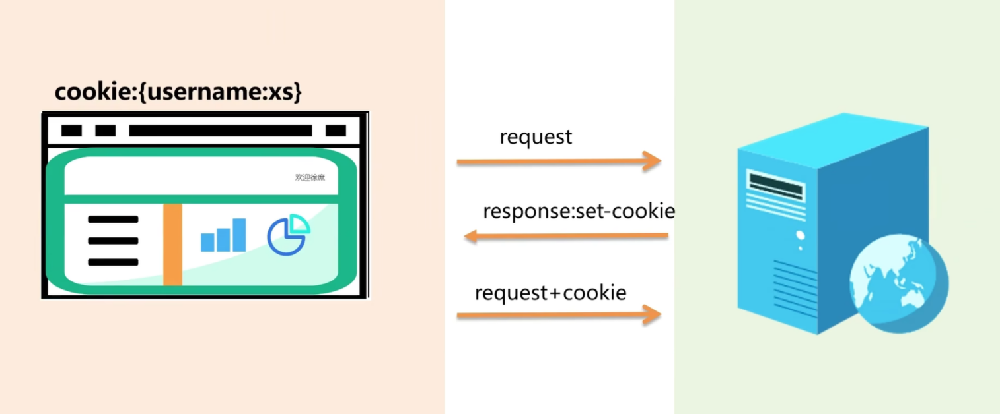
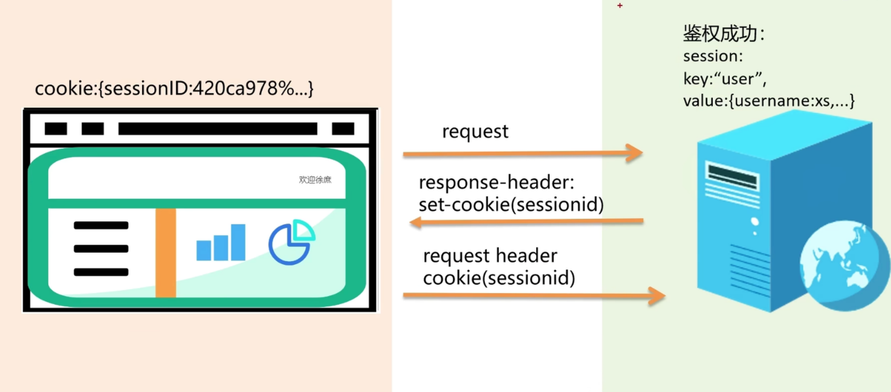
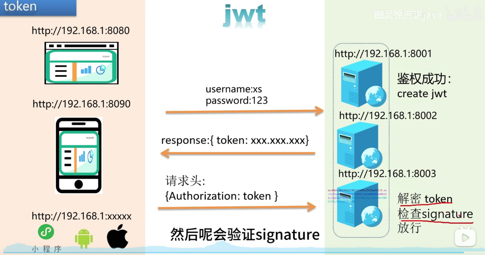

# 登陆信息鉴权

## Cookie
- 存储在浏览器即客户端中，大小限制4KB
- 每次请求都会携带cookie，存在安全隐患，即用户可本地修改cookie的内容，或者泄漏cookie的内容
- 适合存储少量信息，比如session id
- cookie的生存周期
  - session cookie, 会话级的cookie,浏览器关闭即失效
  - persistent cookie, 持久化cookie, 会被存储在浏览器的cookie机制中，本地缓存，设置过期时间后失效
- cookie在使用的过程中需要遵循一定的限制条件，包括Domain, Path, Secure, HttpOnly, SameSite
使用上时，cookie的跨域策略只由domain和path决定，可以通过domain设置cookie可以共享主域以实现跨子域的共享。
  - Domain: 指定cookie的域名，默认是当前域名，可以设置为当前域名的父域名 （如当前域名是 a.b.com, 则可以设置为 b.com, 但不能设置为 c.b.com） 
  - Path: 指定cookie的路径，默认是当前路径，可以设置为当前路径的父路径路径（如当前路径是 /a/b/c, 则可以设置为 /a/b, /a, /, 但不能设置为 /a/b/c/d）
  - Secure: 指定cookie只能在https协议下发送，http协议下不发送
  - HttpOnly : 指定cookie不能被js脚本访问，防止xss攻击窃取cookie
  - SameSite: 指定cookie的同站请求策略，防止csrf攻击

在图片显示的过程中，浏览器作为客户端登陆，发送登陆请求到服务器，服务器在响应头中携带set-cookie的信息，让浏览器能够知道这次登陆的cookie鉴权识别是什么，之后的浏览器发送请求都会在Header中带上Cookie字段

## session
- 过程如下，前端发起登陆请求，后端进行验证，验证过后生成一个session存储在服务器，并且在响应中设置header字段set-cookie内的session为session id, 这样客户端在之后的请求中会在cookie字段中携带session id,这样服务器就能识别用户。
- session是存储在服务器端的，session id存储在客户端的cookie中
- session的大小没有限制，存储在服务器端，可以存储大量信息
- session的生存周期一般是浏览器关闭即失效，也可以设置过期时间
- session的使用需要服务器端支持，一般是通过session id来识别用户
- session的跨域问题同cookie一样，有domain和path决定，因为session是通过cookie使用的，在大集群上效果也不佳，因为单一服务器存储的session无法被其他服务器识别，难以同步session信息，这样客户端在请求时如果被负载均衡到另一台服务器可能出现失效的情况

## token
- token是存储在客户端的，一般是localStorage或者sessionStorage中
- token的大小没有限制，可以存储大量信息
- token的生存周期一般是永久存储，除非手动删除
- token的使用不需要服务器端支持，一般是通过jwt来识别用户
